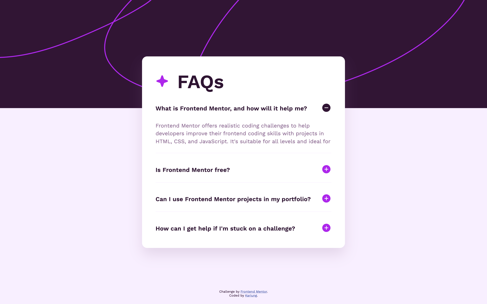

# Frontend Mentor - FAQ accordion solution

This is a solution to the [FAQ accordion challenge on Frontend Mentor](https://www.frontendmentor.io/challenges/faq-accordion-wyfFdeBwBz). Frontend Mentor challenges help you improve your coding skills by building realistic projects.

## Table of contents

- [Frontend Mentor - FAQ accordion solution](#frontend-mentor---faq-accordion-solution)
  - [Table of contents](#table-of-contents)
  - [Overview](#overview)
    - [The challenge](#the-challenge)
    - [Challenge result](#challenge-result)
    - [Screenshot](#screenshot)
    - [Links](#links)
  - [My process](#my-process)
    - [Built with](#built-with)
    - [What I learned](#what-i-learned)
    - [Continued development](#continued-development)
    - [Useful resources](#useful-resources)
  - [Author](#author)
  - [Acknowledgments](#acknowledgments)

## Overview

### The challenge

Users should be able to:

- Hide/Show the answer to a question when the question is clicked
- Navigate the questions and hide/show answers using keyboard navigation alone
- View the optimal layout for the interface depending on their device's screen size
- See hover and focus states for all interactive elements on the page

### Challenge result

- **05 Sep 2025**
  - ✅ Hide/Show the answer to a question when the question is clicked
  - ✅ View the optimal layout for the interface depending on their device's screen size
  - ⚠️ See hover and focus states for all interactive elements on the page (basic cursor pointer added, hover/focus styles to be improved)
  - ❌ Navigate the questions and hide/show answers using keyboard navigation alone

### Screenshot

<ul>
<li>Desktop view
  
</li>
<li>Mobile view  
  
</li>
</ul>

### Links

- Solution URL: [FAQ Accordion with CSS and JS - Frontend Mentor](https://www.frontendmentor.io/solutions/faq-accordion-with-css-and-js-CdqFFUpevg)
- Live Site URL: [Frontend Mentor | FAQ accordion](https://vangmanawkairung.github.io/frontend-mentor-faq-accordion/)

## My process

### Built with

- Semantic HTML5 markup
- CSS custom properties (variables)
- Flexbox
- CSS Grid
- Responsive design with media queries
- Vanilla JavaScript (DOM manipulation & event handling)
- CSS transitions for smooth animations

### What I learned

- **05 Sep 2025**
  - Learned how to use `querySelector()` not only on `document` but also on specific elements to scope DOM selection.
  - Practiced using `scrollHeight` to dynamically set `max-height` for smooth accordion transitions.
  - Implemented CSS transitions with `max-height` and `opacity` instead of `display`, which cannot be animated.
  - Understood the importance of `cursor: pointer;` and hover/focus states for better UX.
  - Used an image overlay technique (`pointer-events: none;` with opacity) to compare the implementation against the original design mockup.

### Continued development

For the next steps, I would like to focus on completing the remaining challenges:

- Implementing full **keyboard navigation** so that users can open/close questions with only the keyboard.
- Adding clear **hover and focus states** to improve accessibility and the overall user experience.

## Author

- GitHub: [Kirung Vangmanaw](https://github.com/VangmanawKairung)
- Frontend Mentor - [@VangmanawKairung](https://www.frontendmentor.io/profile/VangmanawKairunge)

## Acknowledgments

I would like to sincerely thank **myself** for not giving up and continuing to push forward.  
A big thank you to the **Frontend Mentor team** for creating this challenge and giving me the opportunity to practice and improve my skills.  
I am also grateful to **OpenAI** and **Google** for creating **ChatGPT** and **Gemini**, which made it easier for me to complete this challenge and learn new techniques along the way.  
Lastly, I want to thank every **tool, program, and source of encouragement** that supported me during this process. Without them, I wouldn’t have been able to finish this challenge successfully.
